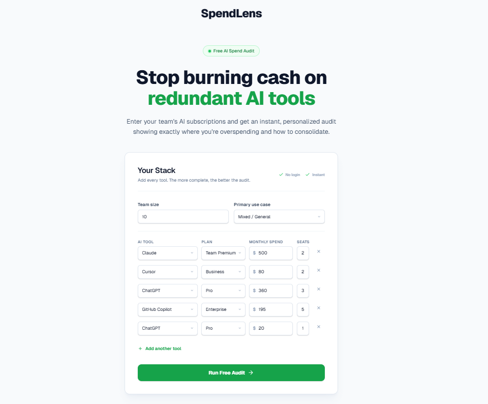
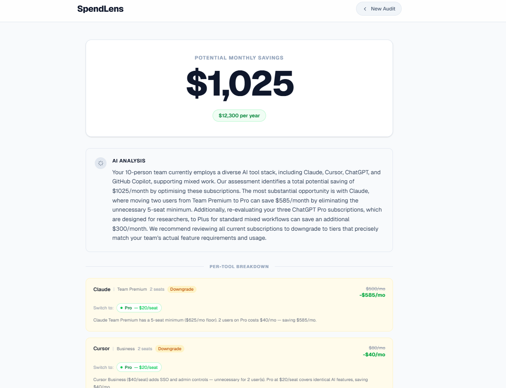
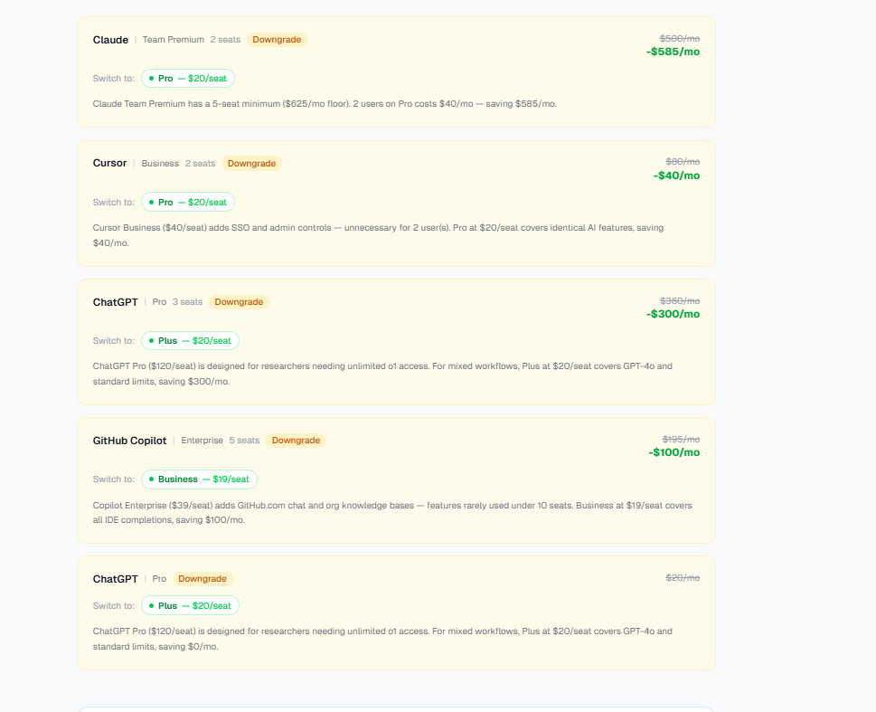

# SpendLens — Free AI Spend Audit

SpendLens audits your team's AI tool subscriptions and 
tells you exactly where you're overspending. Built as a 
lead generation tool for Credex, which sells discounted 
AI credits.

**Live URL:** http://spend-lens-eta.vercel.app/

---

## Screenshots







---

## Quick Start

### Install

```bash
git clone https://github.com/Raamanjal/SpendLens.git
cd spendlens
npm install
```

### Environment Variables

Copy `.env.example` to `.env.local` and fill in:

```bash
cp .env.example .env.local
```

Required keys:
- `NEXT_PUBLIC_SUPABASE_URL` — from supabase.com
- `NEXT_PUBLIC_SUPABASE_ANON_KEY` — from supabase.com
- `SUPABASE_SERVICE_ROLE_KEY` — from supabase.com
- `GEMINI_API_KEY` — from aistudio.google.com
- `RESEND_API_KEY` — from resend.com
- `NEXT_PUBLIC_BASE_URL` — your deployed URL

### Run Locally

```bash
npm run dev
```

Open http://localhost:3000

### Run Tests

```bash
npm test
```

### Deploy

Connect repo to Vercel. Add environment variables 
in dashboard. Deploy.

---

## Decisions

**1. Next.js App Router over Pages Router**
App Router gives server components, streaming, and 
built-in OG metadata generation. The shareable audit 
page needed server-side data fetching for OG tags to 
work correctly on social media — App Router handles 
this cleanly.

**2. Audit engine as pure functions, not AI**
The audit logic is hardcoded rules, not an LLM. A 
finance-literate person needs to agree with every 
recommendation. Hardcoded rules are deterministic, 
testable, and defensible. AI is only used for the 
summary paragraph where imprecision is acceptable.

**3. Gemini 1.5 Flash over Anthropic for summary**
Gemini Flash is faster and cheaper for a ~100 word 
summary task. The summary is cosmetic — it wraps 
real audit numbers in readable prose. Pro-level 
reasoning is unnecessary here.

**4. Supabase over a custom Postgres**
Free tier, no infrastructure to manage, built-in RLS 
for lead data privacy, and a JS SDK that works cleanly 
in Next.js API routes. For an MVP processing under 
1000 audits/day this is more than sufficient.

**5. Form state in localStorage, not URL params**
URL params for a multi-tool form with 4 fields per 
row becomes unwieldy. localStorage is simpler, 
survives refreshes, and the data never needs to be 
shareable — only the result page is shared.